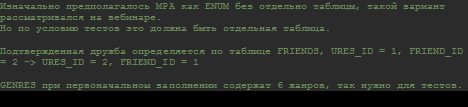

# java-filmorate
Template repository for Filmorate project.

## Диаграмма по спринту 11


###### Краткое описание таблиц
```
Изанчально предпологалось MPA как ENUM без отлельно таблцы, такой варинат рассматривался на вебинаре. 
Но по условию тестов это должна быть отедльная таблица.

Подтвержденная дружба определяется по таблице FRIENDS, URES_ID = 1, FRIEND_ID = 2 -> URES_ID = 2, FRIEND_ID = 1 

GENRES при первоначальном заполенении содеражт 6 жанров, так нужно для тестов.
```
###### Примеры запроса к оснвным таблицам
```
-- получение фильмов фильмов
select * 
from FILMS 
LEFT JOIN MPA 
where FILMS.MPA_ID = MPA.ID AND FILMS.ID = ?;

-- получение жанров фильма (по порядку)
select * 
from GENRES g 
left join FILMS_GENRES fg 
where fg.GENRE_ID = g.ID and fg.FILM_ID in (?) ORDER BY g.ID;

- получение друзей позапросом
select * 
from USERS 
where ID = (select FRIEND_ID from FRIENDS where USER_ID = ?);

-- получение друзей соединением
select * 
from USERS 
left join FRIENDS 
where USERS.ID = FRIENDS.FRIEND_ID 
and FRIENDS.USER_ID = ?;

-- общие друзья
select * 
from USERS 
left join FRIENDS 
where USERS.ID = FRIENDS.FRIEND_ID 
and USER_ID = ? 
and FRIEND_ID 
in (select FRIEND_ID from FRIENDS where USER_ID = ?);

```
